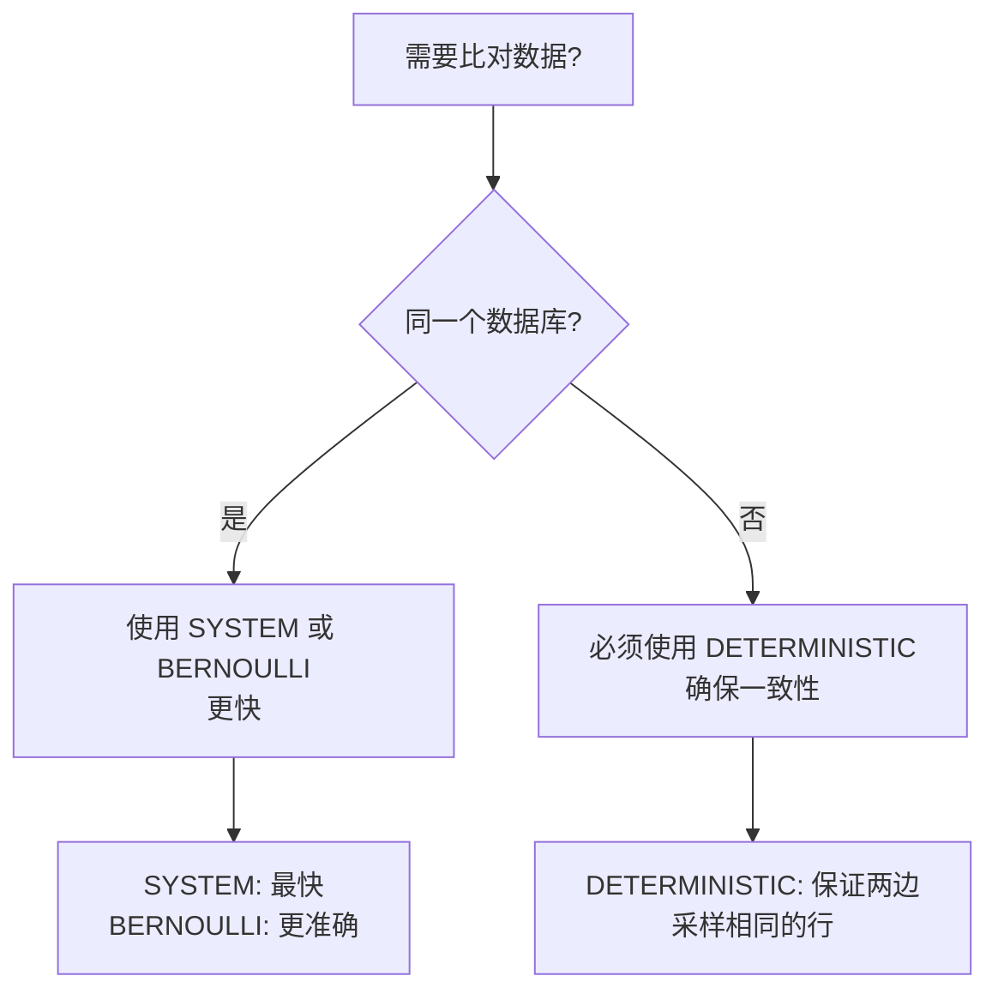

# Data Comparison 采样功能快速参考

## 🚀 快速开始

### 什么时候需要采样？

| 表大小 | 建议 | 原因 |
|--------|------|------|
| < 10万行 | ❌ 不需要采样 | 数据量小，全量比对很快 |
| 10万-100万行 | ⚡ 可选采样 | 可以提升 2-5x 性能 |
| 100万-1000万行 | ✅ 建议采样 | 可以提升 10-20x 性能 |
| > 1000万行 | 🔴 强烈建议采样 | 避免超时和内存问题 |

### 采样方法选择指南



## 📊 参数设置建议

### 1. 采样大小设置

**固定大小 vs 百分比？**
- **固定大小**：适合需要可预测性能的场景
  - 示例：始终采样 50,000 行
  - 优点：执行时间稳定
  
- **百分比**：适合数据量变化的场景
  - 示例：始终采样 5%
  - 优点：自动适应数据增长

### 2. 推荐配置示例

#### 🔍 快速检查（开发/测试环境）
```json
{
  "enableSampling": true,
  "samplingType": "size",
  "sampleSize": 1000,
  "samplingMethod": "SYSTEM",
  "samplingConfidence": 0.90,
  "samplingMarginOfError": 0.05
}
```
- ⏱️ 执行时间：秒级
- 📊 准确度：~90%

#### ⚖️ 平衡模式（日常监控）
```json
{
  "enableSampling": true,
  "samplingType": "percent",
  "samplePercent": 10,
  "samplingMethod": "DETERMINISTIC",
  "samplingConfidence": 0.95,
  "samplingMarginOfError": 0.01
}
```
- ⏱️ 执行时间：分钟级
- 📊 准确度：~95%

#### 🎯 高精度模式（生产验证）
```json
{
  "enableSampling": true,
  "samplingType": "percent",
  "samplePercent": 20,
  "samplingMethod": "DETERMINISTIC",
  "samplingConfidence": 0.99,
  "samplingMarginOfError": 0.001
}
```
- ⏱️ 执行时间：较长
- 📊 准确度：>99%

## 🔧 常见问题解答

### Q1: 为什么跨数据库必须用 DETERMINISTIC？

**问题**：使用 SYSTEM 或 BERNOULLI 时，PostgreSQL 可能采样行 1,5,9，而 MySQL 采样行 2,6,8

**结果**：所有行都被报告为"差异"（假阳性）

**解决**：DETERMINISTIC 使用主键计算确保两边采样相同的行

### Q2: 采样结果怎么理解？

示例输出：
```json
{
  "sample_size": 10000,
  "differences_found": 50,
  "estimated_total_differences": 500,
  "confidence_interval": [450, 550],
  "confidence_level": 0.95
}
```

**解释**：
- 采样了 10,000 行
- 发现 50 个差异
- 推测总共约有 500 个差异
- 95% 确信实际差异在 450-550 之间

### Q3: 如何选择置信度和误差范围？

| 场景 | 置信度 | 误差范围 | 说明 |
|------|--------|----------|------|
| 快速检查 | 90% | ±5% | 快速但粗略 |
| 日常监控 | 95% | ±1% | 平衡之选 |
| 关键验证 | 99% | ±0.1% | 高精度但慢 |

### Q4: 采样对哪些数据库有效？

✅ **完全支持**（所有采样方法）：
- PostgreSQL, MySQL, ClickHouse, Snowflake, BigQuery, Databricks, DuckDB, SQL Server, Oracle, Presto/Trino, Vertica, Redshift

⚠️ **需要注意**：
- SQLite：仅支持 DETERMINISTIC
- 其他数据库：使用前请测试

## 💡 最佳实践

### 1. 性能优化
- 确保主键列有索引（DETERMINISTIC 方法需要）
- 先用小采样测试，再增加采样大小
- 监控内存使用，避免 OOM

### 2. 准确性保证
- 关键数据使用 DETERMINISTIC
- 重要比对提高置信度到 99%
- 定期全量比对验证采样准确性

### 3. 故障排查
- 如果结果不一致，检查采样方法
- 如果性能没改善，检查索引
- 如果内存溢出，减小采样大小

## 📈 性能提升预期

| 原始数据量 | 采样率 | 性能提升 | 时间节省 |
|------------|--------|----------|----------|
| 100万行 | 10% | ~10x | 10分钟→1分钟 |
| 1000万行 | 5% | ~20x | 2小时→6分钟 |
| 1亿行 | 1% | ~100x | 10小时→6分钟 |

## 🎯 一句话总结

> **跨数据库用 DETERMINISTIC，同数据库随意选；**  
> **小数据不采样，大数据必须采；**  
> **要快选 SYSTEM，要准选 BERNOULLI。**